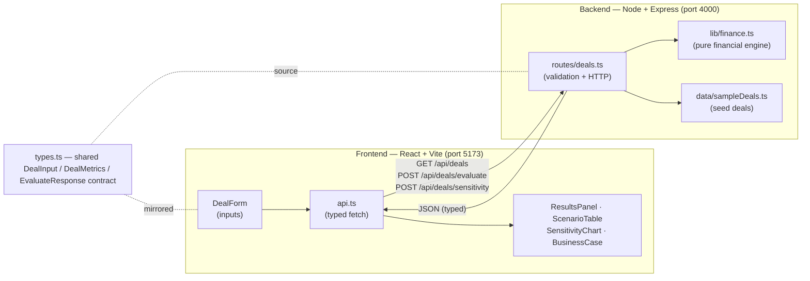
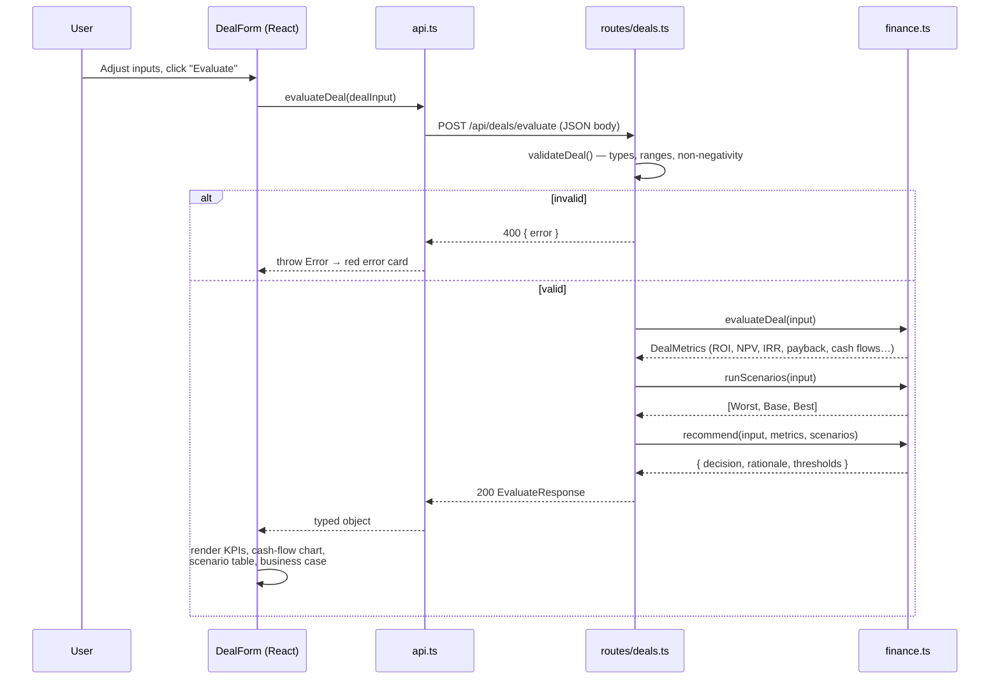
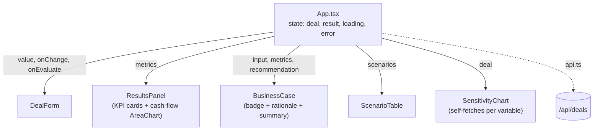

# Strategic Deal ROI Modeler

A full-stack **deal-desk application** for evaluating strategic partner deals — the pricing,
incentive, and investment decisions a hardware-partner sales organization makes every day. You
enter a proposed deal (committed units, attach rate, revenue/unit, margin, and the incentive
stack) and the app returns full deal economics, best/base/worst scenario analysis, one-way
sensitivity, and an auto-generated business case with an **Approve / Revise** recommendation
measured against funding hurdles.

It was built to demonstrate the analytics behind **Pricing, Strategic Deals & Investments**:
NPV / IRR / ROI / payback modeling, scenario and sensitivity analysis, and turning raw numbers
into an executive-ready recommendation.

---

## Table of Contents

1. [System Architecture](#system-architecture)
2. [Request Lifecycle](#request-lifecycle)
3. [The Shared Contract](#the-shared-contract)
4. [Backend Architecture](#backend-architecture)
5. [The Financial Model (the core of the app)](#the-financial-model)
6. [Frontend Architecture](#frontend-architecture)
7. [API Reference](#api-reference)
8. [Design Decisions & Tradeoffs](#design-decisions--tradeoffs)
9. [Project Structure](#project-structure)
10. [Running Locally](#running-locally)
11. [Extending the System](#extending-the-system)
12. [Verification](#verification)

---

## System Architecture

The app is a classic **two-tier client/server** split with a **single typed contract** shared
across the boundary. The frontend never computes deal economics itself — all financial math lives
in one pure module on the server, so the browser and the API can never disagree about a number.



**Why this shape:**

- **Pure domain core.** `finance.ts` has zero dependencies on Express, HTTP, or React. It is just
  functions: `DealInput → DealMetrics`. That makes it trivially testable and reusable (CLI, batch,
  serverless) and keeps the money math in exactly one place.
- **Thin routing layer.** `routes/deals.ts` does validation and HTTP plumbing only, then delegates
  to the engine. No business logic leaks into the transport layer.
- **Contract-first.** `types.ts` is mirrored on both sides, so a field rename surfaces as a
  TypeScript error on both client and server rather than a silent runtime bug.

---

## Request Lifecycle

What actually happens when a user clicks **Evaluate**:



The sensitivity chart follows the same path against `POST /api/deals/sensitivity`, re-running the
engine once per point in the sweep.

---

## The Shared Contract

`types.ts` (duplicated verbatim in `backend/src` and `frontend/src`) is the spine of the app. The
key types:

| Type | Role |
|------|------|
| `DealInput` | Everything the user enters: identity (`dealName`, `partnerName`, `partnerCategory`, `region`, `dealType`) plus the economic levers (`termMonths`, `rampMonths`, `committedUnits`, `attachRatePct`, `revenuePerUnit`, `grossMarginPct`, `upfrontInvestment`, `perUnitIncentive`, `fixedAnnualIncentive`, `discountRatePct`). |
| `DealMetrics` | Everything the engine computes: `grossRevenue`, `grossProfit`, `totalIncentiveCost`, `netProfit`, `roi`/`roiPct`, `npv`, `irrPct`, `paybackMonths`, `breakEvenUnits`, plus the time-phased `monthlyCashFlows` and `cumulativeCashFlows` arrays that drive the chart. |
| `Scenario` | `{ name, assumptions, metrics }` — a labeled re-run of the engine under shocked inputs. |
| `Recommendation` | `{ decision, rationale[], thresholds }` — the business-case verdict. |
| `EvaluateResponse` | The full payload: `{ input, metrics, scenarios, recommendation }`. |
| `SensitivityResult` | `{ variable, label, points[] }` where each point is `{ x, roiPct, npv }`. |

---

## Backend Architecture

A deliberately **layered** Express app. Each file has one job:

```
backend/src/
├── server.ts            HTTP bootstrap: CORS, JSON parsing, route mounting, health check
├── routes/deals.ts      Transport + validation; delegates to the engine
├── lib/finance.ts       PURE financial engine — the heart of the system
├── data/sampleDeals.ts  Four seed deals so the app is useful on first load
└── types.ts             Shared contract
```

**`server.ts`** — wires up `cors()` and `express.json()`, exposes `GET /api/health`, mounts the
deals router at `/api/deals`, and listens on `PORT` (default 4000).

**`routes/deals.ts`** — owns the three endpoints. Its `validateDeal()` guard checks that every
required numeric field is a real non-negative number and that bounded fields stay in range
(`attachRatePct ≤ 100`, `grossMarginPct ≤ 100`, `termMonths ≥ 1`) before any math runs. Invalid
requests get a `400` with a human-readable message; the engine only ever sees clean input.

**`lib/finance.ts`** — the pure engine. No imports except the shared types. See below.

---

## The Financial Model

This is the substance of the project. All formulas live in `lib/finance.ts` as small, composable,
side-effect-free functions.

### 1. Headline economics (`evaluateDeal`)

```
attachedUnits      = committedUnits × (attachRatePct / 100)
grossRevenue       = attachedUnits × revenuePerUnit
grossProfit        = grossRevenue × (grossMarginPct / 100)

variableIncentive  = perUnitIncentive × committedUnits
fixedIncentive     = fixedAnnualIncentive × (termMonths / 12)
totalIncentiveCost = upfrontInvestment + variableIncentive + fixedIncentive

netProfit          = grossProfit − totalIncentiveCost
ROI                = netProfit / totalIncentiveCost
```

ROI here is **return on incentive spend** — net profit generated per dollar of incentive
committed — which is the number a deal desk actually defends.

### 2. Time-phased cash flows (drives NPV, IRR, payback, and the chart)

Volume rarely lands evenly, so the model **ramps** it. `rampWeights()` builds a monthly weight
vector that rises linearly for `rampMonths`, then holds flat at full run-rate, and normalizes so
the weights sum to 1 (total volume is conserved regardless of ramp length).

For each month *m*:

```
unitsₘ      = committedUnits × weightₘ
grossProfitₘ = unitsₘ × (attachRatePct/100) × revenuePerUnit × (grossMarginPct/100)
cashFlowₘ   = grossProfitₘ − (unitsₘ × perUnitIncentive) − (fixedIncentive / termMonths)
```

with `t0 = −upfrontInvestment` as the initial outflow. The cumulative sum of this series is what
the **cumulative cash-flow chart** plots.

### 3. NPV

```
monthlyRate = (1 + discountRatePct/100)^(1/12) − 1
NPV         = Σ  cashFlowₜ / (1 + monthlyRate)^t
```

The annual discount rate is converted to a **monthly** rate (geometric, not simple division) so it
matches the monthly cash-flow granularity.

### 4. IRR (`irr`, bisection)

IRR is the rate that makes NPV zero. It is found numerically by **bisection**: the function first
confirms the cash-flow series actually changes sign (otherwise IRR is undefined and it returns
`null`), expands the upper bound until a root is bracketed, then halves the interval up to 200
times to ~1e-7 precision. The per-period (monthly) IRR is then annualized: `(1 + irrₘ)^12 − 1`.

> Bisection was chosen over Newton-Raphson on purpose — it cannot diverge and needs no derivative,
> so it is robust for the irregular, sign-changing cash flows real deals produce.

### 5. Payback period (`paybackPeriod`)

Walks the cumulative array to find the first month it turns non-negative, then **linearly
interpolates within that month** for a fractional figure (e.g. 11.3 months) instead of rounding to
a whole month. Returns `null` if the deal never pays back inside the term.

### 6. Break-even volume

Solving `netProfit(V) = 0` for committed units, holding per-unit economics constant:

```
perUnitContribution = (attachRatePct/100) × revenuePerUnit × (grossMarginPct/100) − perUnitIncentive
breakEvenUnits      = (upfrontInvestment + fixedIncentive) / perUnitContribution
```

If per-unit contribution is ≤ 0 (incentive exceeds per-unit margin), break-even is `Infinity` — the
deal can't get there on volume alone.

### 7. Scenario analysis (`runScenarios`)

Re-runs the whole engine under three labeled assumption sets:

| Scenario | Volume | Attach | Margin |
|----------|--------|--------|--------|
| **Worst** | −20% | −20% | −10% |
| **Base** | as entered | as entered | as entered |
| **Best** | +15% | +10% (capped 100%) | +5% (capped 100%) |

### 8. Recommendation (`recommend`)

Measures the base case against three hurdles, with a worst-case downside gate:

```
Hurdles:  ROI ≥ 25%   ·   NPV ≥ 0   ·   payback ≤ 75% of term

Approve                 → all three hurdles pass AND worst case stays profitable
Approve with conditions → all three hurdles pass BUT worst case turns unprofitable
Revise                  → any hurdle fails
```

Each check appends a plain-English line to `rationale[]`, which the UI renders as the body of the
business case.

---

## Frontend Architecture

A small, presentational React tree. State lives in `App.tsx`; every child is a pure render of
props. No Redux, no context — the state surface is too small to justify it.



**State flow:**

1. On mount, `App` calls `fetchSampleDeals()`, seeds the form with the default deal, and
   immediately evaluates it — so the dashboard is populated on first paint, not blank.
2. Editing any field calls `onChange`, updating `deal` in `App`.
3. **Evaluate** calls `evaluateDeal(deal)`; the response hydrates `ResultsPanel`,
   `BusinessCase`, and `ScenarioTable`.
4. `SensitivityChart` is the one semi-autonomous component: it owns a "sweep variable" dropdown,
   derives a 60–140% range around the current value, and calls `fetchSensitivity()` itself
   whenever the deal or variable changes (with request-cancellation to avoid races).

**Component responsibilities:**

| Component | Responsibility |
|-----------|----------------|
| `DealForm` | All inputs + a sample-deal loader. |
| `ResultsPanel` | Six KPI cards (ROI, NPV, IRR, payback, net profit, break-even) + a Recharts `AreaChart` of cumulative cash flow. |
| `ScenarioTable` | Worst / base / best comparison across ROI, NPV, net profit, payback. |
| `SensitivityChart` | Recharts `LineChart` of ROI vs. a selectable driver, with a reference line at the current value. |
| `BusinessCase` | Recommendation badge (color-coded), the hurdle rationale list, and a written deal summary. |
| `api.ts` | Three typed fetch wrappers; reads `VITE_API_URL` (falls back to the dev proxy). |
| `format.ts` | `money()`, `units()`, `pct()`, `months()` display helpers. |

Charts use **Recharts**; styling is hand-written **plain CSS** in `index.css` (CSS variables for
the palette) — no Tailwind, deliberately, so the project is portable and dependency-light.

---

## API Reference

Base URL: `http://localhost:4000`

### `GET /api/health`
Liveness probe. → `{ "status": "ok", "service": "deal-roi-modeler", "time": "<ISO>" }`

### `GET /api/deals`
Returns the bundled sample deals and the default. → `{ "deals": DealInput[], "default": DealInput }`

### `POST /api/deals/evaluate`
**Body:** a `DealInput`. **Returns:** `EvaluateResponse` = `{ input, metrics, scenarios, recommendation }`.
Validation failures return `400 { error }`.

### `POST /api/deals/sensitivity`
**Body:** `{ deal: DealInput, variable: keyof DealInput, from: number, to: number, steps?: number }`.
**Returns:** `{ variable, label, points: [{ x, roiPct, npv }] }`.

---

## Design Decisions & Tradeoffs

- **All math server-side, in one pure module.** The browser is a renderer. This guarantees the
  number on screen and the number an API consumer gets are identical, and makes the engine unit-
  testable in isolation.
- **Bisection for IRR.** Robustness over speed — it can't diverge on the irregular cash flows real
  deals produce, and needs no derivative.
- **Monthly granularity with a volume ramp.** A flat annual model overstates early cash and flatters
  payback. Ramping monthly volume makes payback and NPV realistic.
- **Plain CSS, no Tailwind.** One fewer build dependency and no config; the styling surface is small
  enough that hand-written CSS with variables is clearer and fully portable.
- **No database.** Deals are computed on demand and seed data is in code. The project is about the
  *analytics*, and statelessness keeps it trivial to run and deploy.
- **Contract duplicated, not imported across packages.** Keeps frontend and backend independently
  buildable/deployable without a shared-package build step, at the cost of keeping two files in sync.

---

## Project Structure

```
strategic-deal-roi-modeler/
├── README.md
├── .gitignore
├── backend/
│   ├── package.json            express, cors, tsx, typescript
│   ├── tsconfig.json           CommonJS, ES2021, strict
│   └── src/
│       ├── server.ts           Express bootstrap (port 4000)
│       ├── types.ts            Shared contract
│       ├── routes/deals.ts     /api/deals endpoints + validation
│       ├── lib/finance.ts      Pure engine: npv, irr, payback, evaluateDeal,
│       │                       runScenarios, sensitivity, recommend
│       └── data/sampleDeals.ts Four fictional seed deals
└── frontend/
    ├── package.json            react, recharts, vite
    ├── vite.config.ts          dev server :5173, proxies /api → :4000
    ├── index.html
    └── src/
        ├── main.tsx            React entry
        ├── App.tsx             State + layout
        ├── api.ts              Typed fetch wrappers
        ├── types.ts            Shared contract (mirror)
        ├── format.ts           Display formatters
        ├── index.css           Theme (CSS variables)
        └── components/
            ├── DealForm.tsx
            ├── ResultsPanel.tsx
            ├── ScenarioTable.tsx
            ├── SensitivityChart.tsx
            └── BusinessCase.tsx
```

---

## Running Locally

Two terminals.

**Backend** (http://localhost:4000):

```bash
cd backend
npm install
npm run dev      # tsx watch
```

**Frontend** (http://localhost:5173):

```bash
cd frontend
npm install
npm run dev
```

Vite proxies `/api` to the backend, so no extra config is needed. Open
http://localhost:5173 — the default sample deal evaluates automatically. To point the frontend at
a deployed API, set `VITE_API_URL` at build time.

Build for production: `npm run build` in each folder (`tsc` then `vite build` for the frontend).

---

## Extending the System

- **Add a metric** (e.g. ROIC, discounted payback): add the field to `DealMetrics` in both
  `types.ts`, compute it in `evaluateDeal`, surface it in `ResultsPanel`.
- **Add a sensitivity driver:** add an entry to `SWEEP_VARS` in `SensitivityChart.tsx` and to
  `VARIABLE_LABELS` in `finance.ts`.
- **Tune the hurdles:** edit the `thresholds` object in `recommend()` — one line.
- **Persist deals:** drop a store behind `routes/deals.ts`; the engine is unaffected because it
  never touched persistence.

---

## Verification

The backend type-checks clean (`tsc --noEmit`) and the engine's output was hand-checked against an
independent calculation for the default deal: gross revenue **$19,125,000**, gross profit
**$13,387,500**, incentive cost **$7,500,000**, net profit **$5,887,500**, **ROI 78.5%**, **NPV
~$4.56M**, **IRR ~175%**, **payback 11.3 months**, **break-even 186,418 units** — all match.

> All companies, partners, and figures in the sample data are fictional and for demonstration only.
